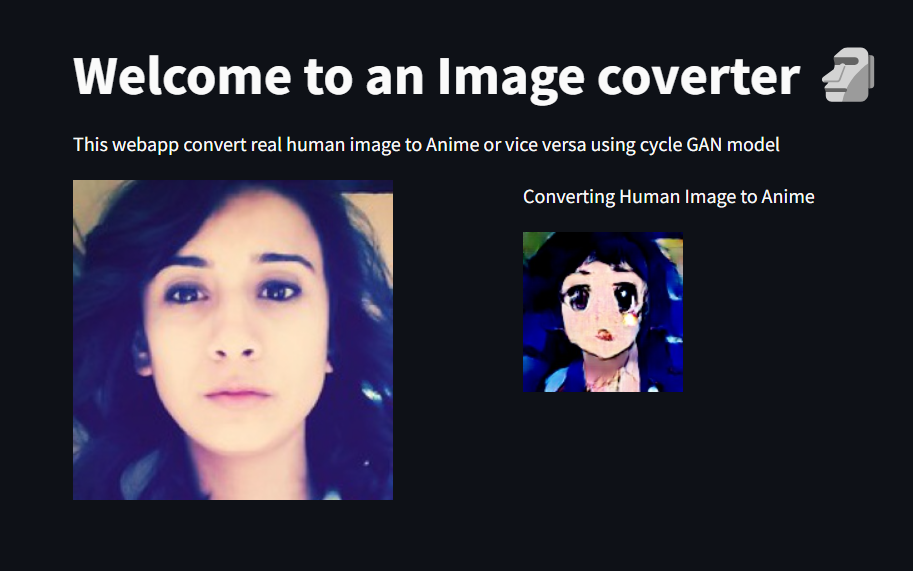

# Face2Anime-project
This is a CycleGAN based project that converts female human images into its anime counterparts 

This web application uses CycleGAN as its underlying model for the image generation. The outputs generated by these two generators are not satisfactory. 
Because of the dataset which contains only human female images and its anime counterparts hence the model's performance for the conversion of male images would be really bad. 

By training the generators on a dataset which contains both female and male images in equal quantity (so that tha model doesn't become bias) for more no. of epochs would result in the imrovement of the performance of the generators. 

If someone wishes to improve its performance consider implementing your own CycleGAN model. You could use dilated convolution layers, use denseNet blocks instead of ResNet blocks, introduce loss functions that would reduce the shape deformation of generated images and compare the results with the original CycleGAN architecture. 

This is how the model is currently performing:- 

